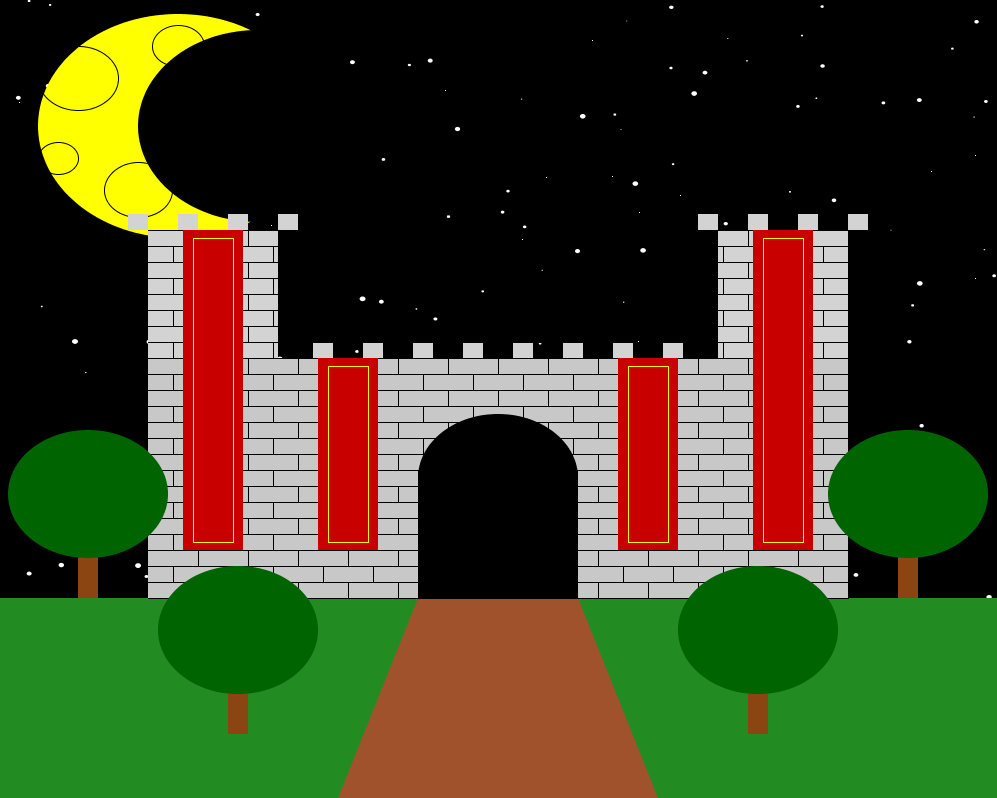
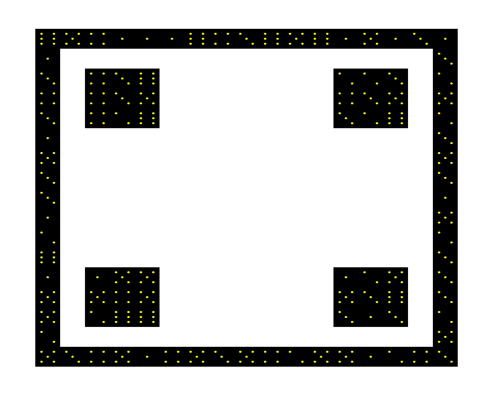
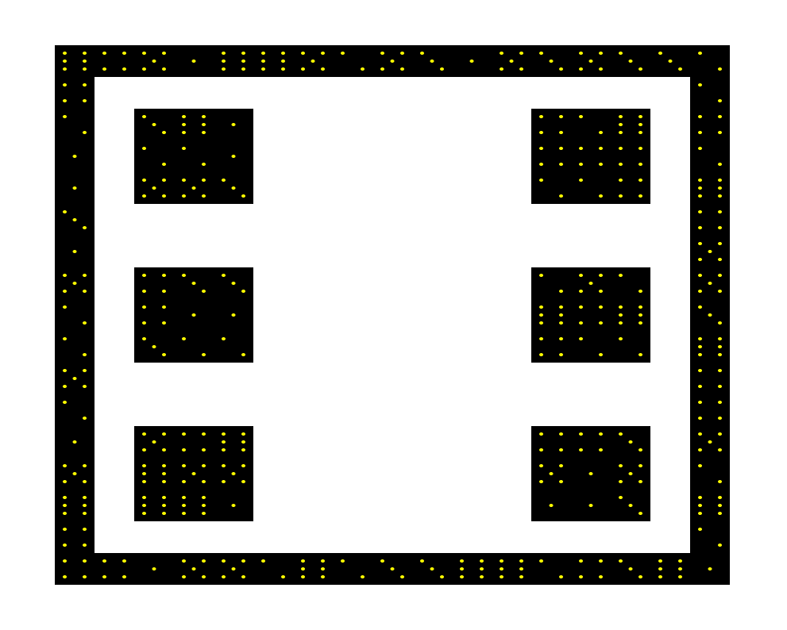
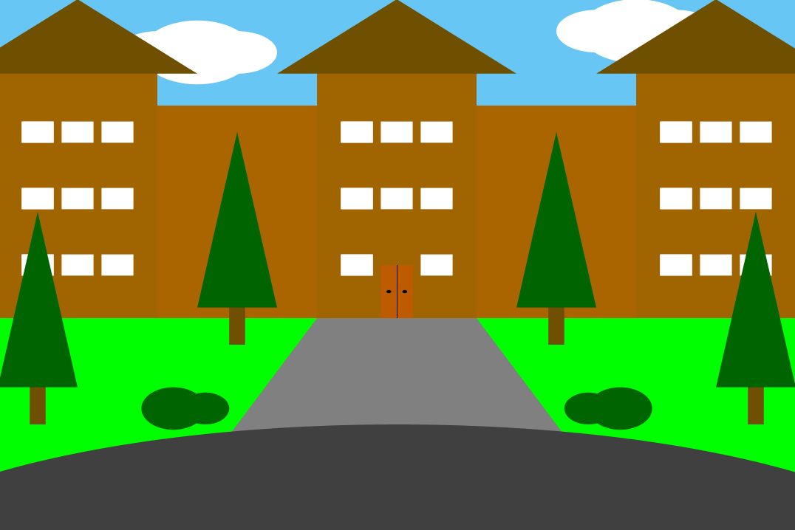

# Mini Projects
Hello! Here is a collection of some of my past projects that I had a lot of fun creating. They were assignments whose
purpose was to get us used to using objects, algorithms, outside libraries, and some other miscellaneous stuff.
## Castle
Draws a picture of a castle. To run, navigate to the *Castle* directory and enter:
    
    java Castle

## DieDraw
Rolls a 6-sided dice and draws a picture representing the number rolled. To run, navigate to the the *DieDraw* directory
and enter:

    java DieDraw
Here is the result of a 4 being rolled.

Here is the result of a 6 being rolled.

## ShermanHall
Draws a picture of WIU's Sherman Hall. To run, navigate to the *ShermanHall* directory and enter:

    java ShermanHall
